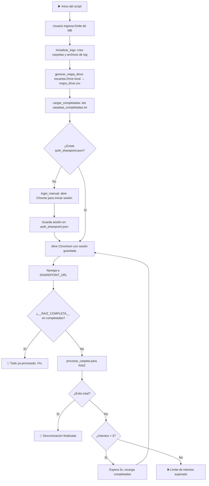
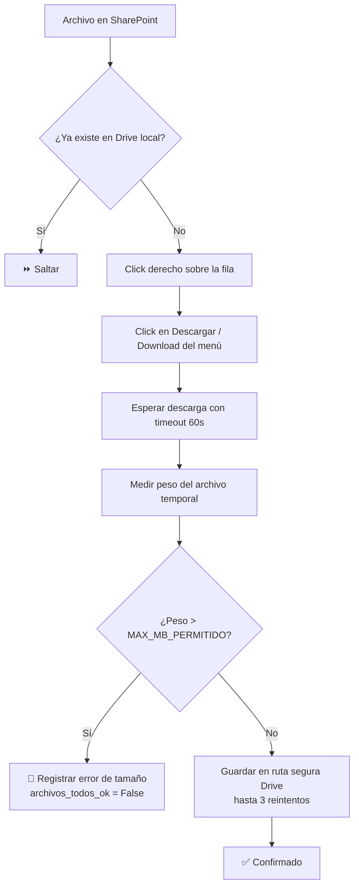
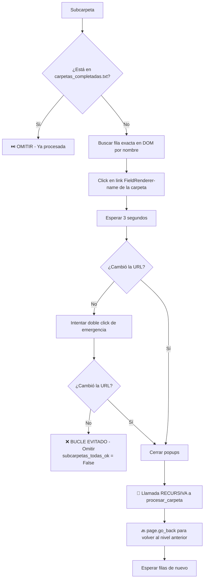
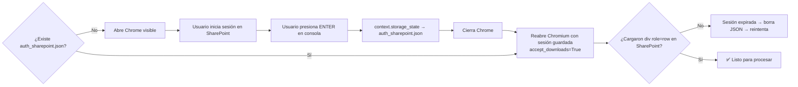

# 📋 Flujo del Script `mover_s2_mejorado.py`

> Script de migración automática de documentos desde **SharePoint** hacia **Google Drive local** usando automatización de navegador.

---

## 🛠️ Herramientas y Librerías

| Herramienta | Para qué sirve |
|---|---|
| `playwright` | Automatiza el navegador Chromium (clicks, navegación, descargas) |
| `os` / `os.path` | Operaciones de sistema de archivos (crear carpetas, verificar existencia) |
| `csv` | Lectura y escritura de archivos de log y mapeo |
| `re` | Expresiones regulares para limpiar nombres y detectar carpetas |
| `time` | Pausas entre acciones para esperar que cargue el navegador |

---

## 📂 Archivos de Configuración

```
RUTA_DESTINO_RAIZ       → Carpeta raíz en Google Drive local (ej: G:\...\2022)
SHAREPOINT_URL          → URL de la carpeta raíz en SharePoint
ARCHIVO_AUTH            → auth_sharepoint.json (sesión guardada del navegador)
ARCHIVO_COMPLETADAS     → carpetas_completadas.txt (registro de progreso)
ARCHIVO_FALTANTES       → errores_descarga.csv (log de archivos con error)
MAX_MB_PERMITIDO        → Límite de tamaño por archivo (se pide al usuario al inicio)
```

---

## 🔄 Flujo General Paso a Paso



---

## 🧩 Funciones del Script

### `inicializar_logs()`
- Crea la carpeta raíz de destino en Drive si no existe.
- Crea el archivo `errores_descarga.csv` con encabezados si no existe.
- Crea el archivo `carpetas_completadas.txt` vacío si no existe.

---

### `generar_mapa_drive()`
- Recorre **recursivamente** la carpeta destino en Google Drive.
- Genera `mapa_drive.csv` con dos columnas: `tipo` (Carpeta/Archivo) y `ruta_relativa`.
- Sirve como **snapshot del estado actual** del Drive al momento de ejecutar.
- Excluye archivos de sistema: `desktop.ini`, `errores_descarga.csv`, `carpetas_completadas.txt`.

---

### `cargar_completadas()`
- Lee `carpetas_completadas.txt` línea por línea.
- Carga las rutas en un `set` Python (búsqueda O(1)).
- Filtra líneas vacías con `.strip()`.
- Usa encoding `utf-8-sig` para tolerar archivos con BOM de Windows.

---

### `marcar_completada(ruta_relativa)`
- Agrega una línea al final de `carpetas_completadas.txt`.
- Si la ruta es vacía (RAIZ), escribe el marcador especial `__RAIZ_COMPLETA__` en lugar de una línea en blanco.

> [!IMPORTANT]
> El marcador `__RAIZ_COMPLETA__` es crítico: evita que una línea vacía en el archivo sea leída erróneamente como "RAIZ completa" al inicio del siguiente run.

---

### `registrar_error(nombre, ruta, error)`
- Agrega una fila al CSV `errores_descarga.csv` con: nombre del archivo, ruta, mensaje de error y fecha/hora.

---

### `login_manual(p)`
- Lanza Chromium en modo visible (headless=False).
- Navega a SharePoint y espera que el usuario inicie sesión manualmente.
- Al presionar ENTER, guarda la sesión en `auth_sharepoint.json`.

---

### `cerrar_popups(page)`
Cierra automáticamente ventanas emergentes de SharePoint mediante:
1. Presiona `Escape`
2. Busca botones con nombre "dismiss"
3. Busca botones de cierre (`aria-label='Cerrar'`, `aria-label='Close'`, ícono `Cancel`)

---

### `analizar_fila(fila)`
Parsea una fila del listado de SharePoint (`div[role='row']`) para identificar:

| Dato | Cómo se detecta |
|---|---|
| **Nombre** | Primera línea del texto de la fila, limpiada de caracteres inválidos |
| **Es carpeta** | Si el texto contiene la palabra "elementos" o tiene ícono de carpeta |
| **Num. elementos** | Extrae el número con regex `(\d+)\s*elementos?` |
| **Es archivo** | Si el nombre contiene extensiones conocidas (.xlsx, .pdf, .docx, etc.) |

> [!NOTE]
> La extensión tiene prioridad: si el nombre tiene `.xlsx` se marca como archivo aunque el texto diga "elemento".

---

### `procesar_carpeta(page, ruta_relativa_actual, completadas)`
Esta es la **función principal y recursiva**. Recibe la página de Playwright ya abierta en la carpeta a procesar.

#### Paso 1 — Crear carpeta local
Crea la carpeta equivalente en Drive local si no existe.

#### Paso 2 — Esperar carga de SharePoint
Espera hasta 15 segundos a que aparezcan las filas de la tabla. Si falla → retorna `False`.

#### Paso 3 — Leer y clasificar elementos del DOM
Itera sobre todos los `div[role='row']` (excepto el primero = encabezado) y los clasifica en dos listas:
- `items_archivo` — nombres de archivos descargables
- `items_carpeta` — diccionarios con nombre y cantidad de elementos

#### Paso 4 — Descargar Archivos



> [!WARNING]
> Si **algún archivo** es omitido por tamaño, la variable `archivos_todos_ok` queda en `False` y la carpeta **no se marcará como completa** al final.

> [!CAUTION]
> Si ocurre un **error de descarga** (timeout, browser cerrado, etc.), la función retorna `False` inmediatamente.

#### Paso 5 — Navegar y procesar Subcarpetas



> [!NOTE]
> La **única condición para omitir** una subcarpeta es que su ruta aparezca exactamente en `carpetas_completadas.txt`. No se usa conteo de archivos ni comparación de cantidades.

#### Paso 6 — Marcar carpeta como completa

La carpeta se registra en `carpetas_completadas.txt` **solo si**:
- ✅ Todos los archivos fueron descargados (sin omisiones por tamaño → `archivos_todos_ok = True`)
- ✅ Todas las subcarpetas fueron procesadas sin errores (→ `subcarpetas_todas_ok = True`)

Si alguna condición falla → retorna `False` → la carpeta padre tampoco se marcará completa.

---

## 🔁 Sistema de Reintentos

El loop principal tiene hasta **3 intentos globales**:

| Intento | Comportamiento |
|---|---|
| 1 | Inicia desde RAIZ, lee `carpetas_completadas.txt` |
| 2 (si crash) | Espera 5s, recarga completadas, retoma donde quedó |
| 3 (si crash) | Último intento de retoma |
| Después del 3 | ❌ Mensaje de error final, proceso detenido |

> [!TIP]
> El script es **reanudable**: al reiniciar siempre lee `carpetas_completadas.txt` y omite automáticamente las carpetas ya procesadas, continuando desde donde se detuvo.

---

## 📁 Archivos Generados

| Archivo | Ubicación | Contenido |
|---|---|---|
| `auth_sharepoint.json` | Carpeta del script | Cookies y sesión del navegador Chromium |
| `carpetas_completadas.txt` | Carpeta del script | Una ruta por línea → carpetas migradas 100% |
| `mapa_drive.csv` | Carpeta del script | Snapshot del Drive local al inicio de cada ejecución |
| `errores_descarga.csv` | Carpeta raíz en Drive | Log de archivos no descargados (tamaño o error de red) |

---

## ✅ Criterios de Completitud de Carpeta

```
¿Se marca como completa?

    archivos_todos_ok
        = True si TODOS los archivos fueron descargados sin omisión por tamaño
        = False si algún archivo superó MAX_MB_PERMITIDO

    subcarpetas_todas_ok
        = True si TODAS las subcarpetas retornaron True recursivamente
        = False si alguna subcarpeta falló o no pudo navegarse

    SI archivos_todos_ok AND subcarpetas_todas_ok:
        → marcar_completada(ruta)   ← escribe en carpetas_completadas.txt
        → return True
    SINO:
        → return False              ← la carpeta padre tampoco se marcará
```

---

## 🔐 Flujo de Autenticación



---

## 🚀 Cómo Ejecutar

```bash
cd "c:\Users\...\sharepoint drive"
python mover_s2_mejorado.py
```

El script preguntará:
```
¿Cuál es el peso MÁXIMO por archivo en MB? (Ej: 50):
```

Ingresa el límite. Los archivos más pesados serán logueados en `errores_descarga.csv` sin bloquear el resto del proceso.
